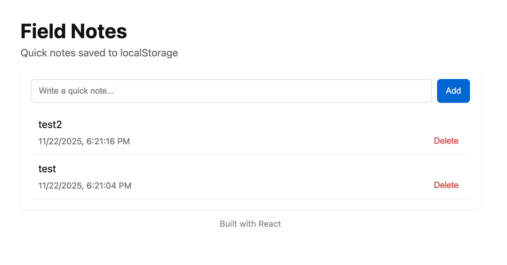

# 📝 fieldnotes

**Local-first sensory, behavioral, and observational data logger for high-stakes field environments.**

`fieldnotes` is Datagotchi Labs' sensory research primitive. Built as an offline-capable, low-entropy observational logger, it enables "Stewards" operating in complex, high-stakes environments (Education, Healthcare, and Community Organizing) to capture high-integrity data without relying on extractive cloud architectures.



---

## 🛡️ Sovereign & Local-First Architecture

Unlike traditional cloud-bound tools that extract user telemetry, `fieldnotes` prioritizes **Protective Stewardship**:

* **Local-First Data:** Powered by **LibSQL / SQLite** for total offline independence, near-zero latency, and true user data ownership.
* **Cognitive Ergonomics:** Custom "Pill UI" designed around visual salience—drastically reducing cognitive overhead during in-situ event logging.
* **Deterministic Logic:** High-reliability state transitions ensuring zero data loss during active field recording.

---

## 🔐 Zero-Trust Privacy & Security Roadmap

We are architecting `fieldnotes` for high-integrity field environments:

* **End-to-End Encryption (E2EE):** E2EE synchronization for all metadata and field logs.
* **Biometric Guarding:** WebAuthn integration (FaceID / TouchID) for secure local sessions.
* **Hardware Sovereignty:** FIDO2 / Yubikey physical security key support to verify steward identity.

---

## 🌉 The `inspect` Integration & Bridge

`fieldnotes` serves as an active primary data collector for the broader Datagotchi Labs platform:

```mermaid
graph LR
    A[In-Situ Field Logs / Pill UI] --> B{Local LibSQL Engine}
    B -->|E2EE Sync Bridge| C{Inference Engine}
    C -->|Cite Encrypted Source Evidence| D[inspect Bayesian Platform]

    style B fill:#2b2b2b,stroke:#00ffcc,color:#fff
    style D fill:#1f1f1f,stroke:#ff0055,color:#fff
